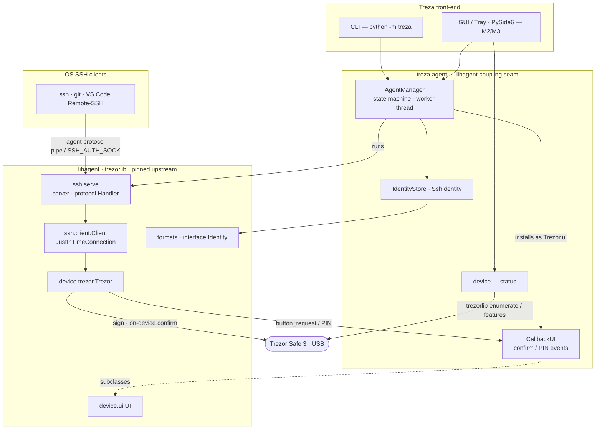

# Treza — Trezor SSH GUI

> ⚠️ **Work in progress — not yet usable as an end-user app.** The headless
> agent core works today; the graphical interface, packaged installers, and the
> Trezor Safe 3 hardware validation are still to come (see the roadmap below).
> Not recommended for production use yet.

A cross-platform desktop app (Windows / macOS / Linux) that lets a **Trezor**
hardware device be used as an SSH key, managed from a GUI — no terminal agent
configuration. Your private key never leaves the device; every signature is
confirmed physically on the Trezor.

Treza is an **integration + GUI layer** on top of
[`romanz/trezor-agent`](https://github.com/romanz/trezor-agent)'s `libagent`
and `trezorlib`. It deliberately does **not** reimplement any cryptography or
the SSH-agent protocol — it reuses the battle-tested implementations.

## Status & roadmap

Early development. Issues and pull requests are welcome — see
[Contributing](#contributing).

| Milestone | What | State |
|-----------|------|-------|
| M0 | Trezor **Safe 3** spike (real SSH login) | ⏳ hardware validation pending |
| M1 | Headless agent integration core | ✅ device-independent core done & tested |
| M2 | Key-management UI (PySide6) | ⬜ planned |
| M3 | System tray + background operation | ⬜ planned |
| M4 | Onboarding / first-run wizard | ⬜ planned |
| M5 | Packaging, signing & CI | ⬜ planned |

### What works today (headless, no GUI yet)

```bash
python -m treza --status                       # detect a connected Trezor
python -m treza --add ssh://user@host          # add an identity (ed25519)
python -m treza --list                         # list stored identities
python -m treza --serve                        # run the SSH agent (Ctrl+C to stop)
```

On Windows the agent serves the OpenSSH-compatible named pipe
`\\.\pipe\openssh-ssh-agent`; on Unix it exports `SSH_AUTH_SOCK`. Standard SSH
clients then route signing to the Trezor automatically.

## Architecture



* `treza/agent/` — the **only** place that touches `libagent`/`trezorlib`
  (an upstream-coupling seam, guarded by `tests/test_coupling.py`):
  * `manager.py` — `AgentManager`: runs `libagent`'s serve loop in-process on a
    worker thread, with a `stopped → starting → running → waiting_confirmation →
    error` state machine.
  * `ui_bridge.py` — `CallbackUI`: subclasses `libagent.device.ui.UI` to surface
    device confirmation / PIN events as callbacks.
  * `identities.py` — `SshIdentity` + `IdentityStore`: identity model, public-key
    export, and persistence in `libagent`'s `<identity|curve>` config format.
  * `device.py` — connection detection and model/firmware/lock status.

All device I/O happens on one worker thread; `trezorlib` handles are not
thread-safe. GUI consumers must marshal state callbacks onto the UI thread.

## Getting started (from source)

Requires Python 3.11+ and the OpenSSH client (`ssh`) on your `PATH`.

```bash
git clone https://github.com/pltlg/treza.git
cd treza
python -m venv .venv

# Windows (PowerShell):
.venv\Scripts\pip install -e ".[dev,gui]"
# macOS / Linux:
.venv/bin/pip install -e ".[dev,gui]"
```

Run the test suite:

```bash
python -m pytest                  # unit + fake-device tests (no hardware)
python -m pytest -m hardware -s   # acceptance tests (a Trezor must be connected)
```

The fake-device tests stand up the **real** `libagent` serve loop backed by
`libagent.device.fake_device.FakeDevice` and talk the SSH-agent protocol to it,
so the agent path is exercised end-to-end without a Trezor.

Pinned dependency set: see `spike/requirements.lock.txt`
(`libagent==0.16.1`, `trezor==0.20.1`, `trezor_agent==0.13.0`).

## Security

* **Your private key never leaves the Trezor.** Treza only ever receives public
  keys and signatures, and only after you physically confirm each operation on
  the device.
* **Treza will never ask for your recovery seed or backup.** Never type your
  seed into any app or website — Treza does not need it and never will.
* Treza performs **no cryptography of its own**; it relies on the audited
  `trezorlib` / `libagent` libraries.
* Builds are currently **unsigned** (code signing and macOS notarization are
  planned for M5), so expect OS warnings until then. Build or install only from
  this repository.
* Found a security issue? Please report it privately via a
  [GitHub security advisory](https://github.com/pltlg/treza/security/advisories/new)
  rather than a public issue.

## Contributing

This is an early-stage project and help is welcome — bug reports, testing on
each OS, and PRs. A few conventions:

* Keep all `libagent` / `trezorlib` usage inside `treza/agent/`, and update
  `tests/test_coupling.py` if you depend on a new upstream symbol.
* Run `python -m pytest` and `python -m ruff check .` before opening a PR.
* See the roadmap above for where the project is headed.

## Disclaimer

Treza is an **independent, community project**. It is **not affiliated with,
endorsed by, or sponsored by SatoshiLabs s.r.o.** "Trezor" is a trademark of
SatoshiLabs; the name "Treza" is derived from it for descriptive purposes only.
Use at your own risk.

## License

Licensed under the **GNU Lesser General Public License v3.0 or later**
(`LGPL-3.0-or-later`) — see [`COPYING.LESSER`](COPYING.LESSER) (the LGPL terms)
and [`COPYING`](COPYING) (the GPL terms it builds on). This matches the license
of the `libagent` / `trezorlib` libraries Treza is built on.
