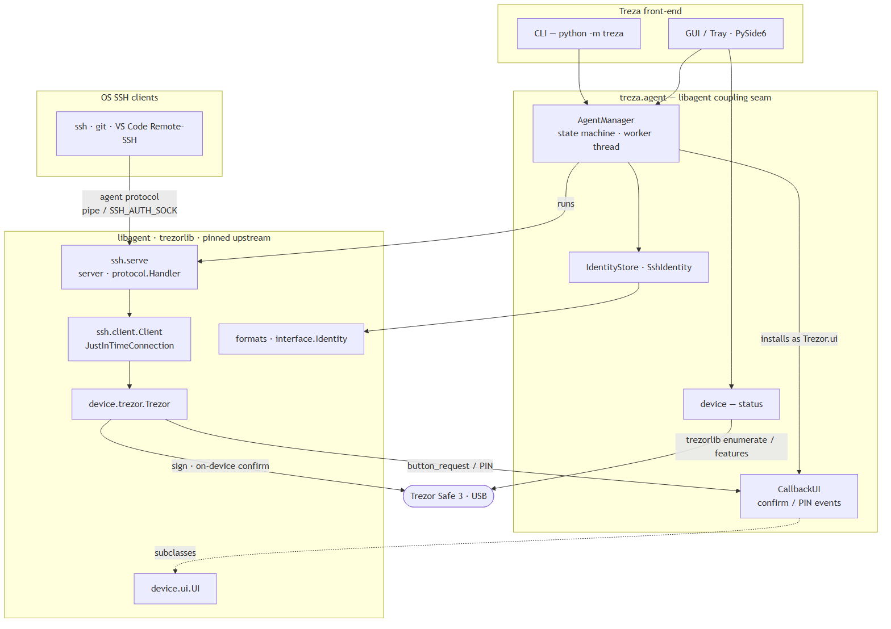

# Treza — Trezor SSH GUI

> ⚠️ **Work in progress — not yet usable as an end-user app.** The headless
> agent core and a first desktop GUI exist; packaged installers and the Trezor
> Safe 3 hardware validation are still to come (see the roadmap below). Not
> recommended for production use yet.

A cross-platform desktop app (Windows / macOS / Linux) that lets a **Trezor**
hardware device be used as an SSH key, managed from a GUI — no terminal agent
configuration. Your private key never leaves the device; every signature is
confirmed physically on the Trezor.

Treza is an **integration + GUI layer** on top of
[`romanz/trezor-agent`](https://github.com/romanz/trezor-agent)'s `libagent`
and `trezorlib`. It deliberately does **not** reimplement any cryptography or
the SSH-agent protocol — it reuses the battle-tested implementations.

## Documentation

* **[User guide](docs/USER_GUIDE.md)** — step-by-step: install, add an identity,
  export your key, and connect.
* **[How it works](docs/HOW_IT_WORKS.md)** — the full pipeline from PIN entry to
  the server granting access, with a diagram.

## Status & roadmap

Early development. Issues and pull requests are welcome — see
[Contributing](#contributing).

| Milestone | What | State |
|-----------|------|-------|
| M0 | Trezor **Safe 3** spike (real SSH login) | ⏳ hardware validation pending |
| M1 | Headless agent integration core | ✅ done & tested |
| M2 | Key-management UI (PySide6) | ✅ implemented |
| M3 | System tray + background operation | ✅ implemented |
| M4 | Onboarding / first-run wizard | ✅ implemented |
| M5 | Packaging, signing & CI | 🚧 PyInstaller, CI & Windows installer done; signing/notarization pending |

## Install on Windows

Two ways: a prebuilt installer, or from source.

### Option A — Installer (quickest)

Download **`treza-setup-<version>.exe`** from the
[latest release](https://github.com/pltlg/treza/releases/latest) and run it
(Start-Menu shortcut + uninstaller).

> The installer is **not code-signed yet** ([signing setup](docs/SIGNING.md)),
> so SmartScreen will warn — choose **More info → Run anyway**. You still need to
> free up the SSH-agent pipe once (Option B, step 2 below).

### Option B — From source

**1. Prerequisites**

* **Python 3.11+** — install from [python.org](https://www.python.org/downloads/windows/)
  and tick *"Add python.exe to PATH"*.
* **Git** — [git-scm.com](https://git-scm.com/download/win).
* **OpenSSH client** — ships with Windows 10/11 (`ssh` is already on `PATH`).

**2. Free up the SSH-agent named pipe.** Windows has a built-in `ssh-agent`
service that claims `\\.\pipe\openssh-ssh-agent` — the same pipe Treza serves
on. Disable it once, in an **Administrator** PowerShell:

```powershell
Stop-Service ssh-agent
Set-Service ssh-agent -StartupType Disabled
```

**3. Install Treza** (regular PowerShell):

```powershell
git clone https://github.com/pltlg/treza.git
cd treza
python -m venv .venv
.venv\Scripts\pip install -e ".[gui]"
```

**4. Run it:**

```powershell
.venv\Scripts\python -m treza          # launches the GUI
```

On first run an onboarding wizard walks you through enabling the agent and
exporting your first key. Connect and unlock your Trezor when prompted; every
signature must be confirmed on the device.

**5. Use it with your tools.** Once the agent is running, standard clients pick
it up automatically over the named pipe:

```powershell
ssh-add -l            # should list your Treza identities
ssh user@server       # confirm the login on the Trezor
git clone git@github.com:you/repo.git
```

VS Code Remote-SSH uses the same `ssh`, so it works with no extra setup.

> Headless / no GUI: `python -m treza --serve` runs just the agent;
> `python -m treza --help` lists the CLI.

## Architecture



<sub>Diagram source: [`docs/architecture.mmd`](docs/architecture.mmd) (Mermaid).</sub>

* `treza/agent/` — the **only** place that touches `libagent`/`trezorlib`
  (an upstream-coupling seam, guarded by `tests/test_coupling.py`):
  * `manager.py` — `AgentManager`: runs `libagent`'s serve loop in-process on a
    worker thread, with a `stopped → starting → running → waiting_confirmation →
    error` state machine.
  * `ui_bridge.py` — `CallbackUI`: subclasses `libagent.device.ui.UI` to surface
    device confirmation / PIN events as callbacks.
  * `identities.py` — `SshIdentity` + `IdentityStore`: identity model, public-key
    export, and persistence in `libagent`'s `<identity|curve>` config format.
  * `device.py` — connection detection and model/firmware/lock status.
  * `agentclient.py` — minimal SSH-agent protocol client (reads public keys from
    the running agent without opening a second device session).
* `treza/gui/` — the PySide6 front-end: `controller.py` (marshals agent worker
  callbacks onto the Qt thread via signals), `main_window.py`, `tray.py`,
  `onboarding.py`, dialogs, and state icons.

All device I/O happens on one worker thread; `trezorlib` handles are not
thread-safe. The GUI never calls the device directly — it goes through the
controller's signals.

## Getting started (from source, any OS)

Requires Python 3.11+ and the OpenSSH client (`ssh`) on your `PATH`.

```bash
git clone https://github.com/pltlg/treza.git
cd treza
python -m venv .venv

# Windows (PowerShell):
.venv\Scripts\pip install -e ".[dev,gui]"
# macOS / Linux:
.venv/bin/pip install -e ".[dev,gui]"
```

Run the test suite:

```bash
python -m pytest                  # unit + fake-device tests (no hardware)
python -m pytest -m hardware -s   # acceptance tests (a Trezor must be connected)
```

The fake-device tests stand up the **real** `libagent` serve loop backed by
`libagent.device.fake_device.FakeDevice` and talk the SSH-agent protocol to it,
so the agent path is exercised end-to-end without a Trezor.

Pinned dependency set: see `spike/requirements.lock.txt`
(`libagent==0.16.1`, `trezor==0.20.1`, `trezor_agent==0.13.0`).

## Building a standalone app

A [PyInstaller](https://pyinstaller.org/) spec produces a self-contained
**onedir** bundle (kept as separate files so the LGPL libraries remain
replaceable):

```bash
pip install -e ".[gui,build]"
pyinstaller packaging/treza.spec --noconfirm   # output in dist/treza/
```

On **Windows**, the build also compiles that bundle into a single
**`treza-setup.exe`** installer with [Inno Setup](https://jrsoftware.org/isinfo.php)
(`packaging/windows/treza.iss`):

```powershell
iscc /DMyAppVersion=0.1.0 packaging\windows\treza.iss   # -> installer\treza-setup.exe
```

CI builds all of this for Windows / macOS / Linux on every `v*` tag
(`.github/workflows/build.yml`) and uploads per-OS bundles plus the Windows
installer. **Code signing (Windows Authenticode) and macOS notarization are
wired up** and activate automatically once the signing secrets are added — see
[docs/SIGNING.md](docs/SIGNING.md). Without those secrets, builds still succeed
and produce **unsigned** artifacts. Linux packaging ships the Trezor udev rules
from `packaging/linux/`.

## Security

* **Your private key never leaves the Trezor.** Treza only ever receives public
  keys and signatures, and only after you physically confirm each operation on
  the device.
* **Treza will never ask for your recovery seed or backup.** Never type your
  seed into any app or website — Treza does not need it and never will.
* Treza performs **no cryptography of its own**; it relies on the audited
  `trezorlib` / `libagent` libraries.
* Builds are **unsigned** unless signing secrets are configured
  ([docs/SIGNING.md](docs/SIGNING.md)), so expect SmartScreen / Gatekeeper
  warnings until then. Build or install only from this repository.
* Found a security issue? Please report it privately via a
  [GitHub security advisory](https://github.com/pltlg/treza/security/advisories/new)
  rather than a public issue.

## Contributing

This is an early-stage project and help is welcome — bug reports, testing on
each OS, and PRs. A few conventions:

* Keep all `libagent` / `trezorlib` usage inside `treza/agent/`, and update
  `tests/test_coupling.py` if you depend on a new upstream symbol.
* Run `python -m pytest` and `python -m ruff check .` before opening a PR.
* See the roadmap above for where the project is headed.

## Disclaimer

Treza is an **independent, community project**. It is **not affiliated with,
endorsed by, or sponsored by SatoshiLabs s.r.o.** "Trezor" is a trademark of
SatoshiLabs; the name "Treza" is derived from it for descriptive purposes only.
Use at your own risk.

## License

Licensed under the **GNU Lesser General Public License v3.0 or later**
(`LGPL-3.0-or-later`) — see [`COPYING.LESSER`](COPYING.LESSER) (the LGPL terms)
and [`COPYING`](COPYING) (the GPL terms it builds on). This matches the license
of the `libagent` / `trezorlib` libraries Treza is built on.
