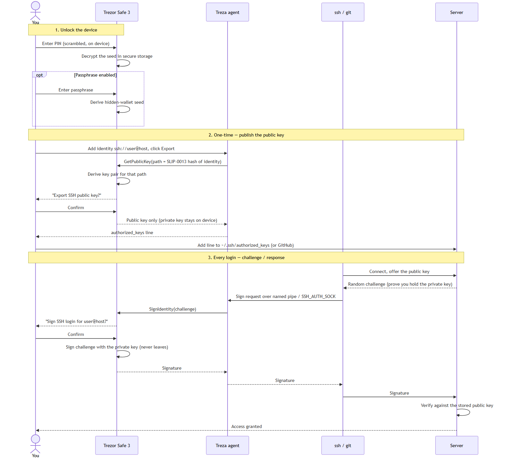

# How it works — from PIN to server access

This walks the full pipeline: unlocking the Trezor, deriving the SSH key pair,
publishing the public key, and the per-login challenge/response that ends with
the server letting you in.

> **A note on terminology.** SSH public-key auth is **signing**, not encryption.
> Treza never encrypts or decrypts your data, and the key pair is used to *prove
> identity*, not to scramble traffic. (The SSH session's traffic encryption is a
> separate Diffie-Hellman key exchange that OpenSSH does on its own.) So this is
> really a *signing / authentication* pipeline.

## 1. Unlocking the device (PIN, and optionally passphrase)

* The Trezor stores your **seed** (the master secret behind every key) in
  encrypted secure storage. **Entering your PIN decrypts that storage** so the
  device can use the seed. The PIN is entered on the device itself, on a
  scrambled keypad — it never travels to the computer.
* If you have a **passphrase** enabled, it is mixed into the seed to produce a
  separate "hidden wallet." Because the keys depend on it, **the same passphrase
  always produces the same SSH keys, and a different passphrase produces
  completely different ones.** (This is why an empty passphrase = your standard
  wallet.)

At this point the device holds the seed in memory but has handed *nothing* to
the computer.

## 2. Deriving the key pair (the part people misread as "generating")

The key pair is **not randomly generated** — it is **deterministically derived**
from the seed, so the same identity always yields the same key, on any computer,
with no key file stored anywhere.

The derivation follows **SLIP-0013**:

1. You name an identity as a URI, e.g. `ssh://user@host`.
2. Treza hashes it (`SHA-256` of an index byte + the URI) and turns the first
   16 bytes into a **BIP-32 derivation path** of hardened indices —
   `13' / h0' / h1' / h2' / h3'`.
3. The Trezor walks that path from the seed to produce one specific key pair —
   Ed25519 or NIST P-256, depending on the curve you chose.

Because the path comes from the identity string, **each `user@host` gets its own
key**, and you can reproduce any of them just by knowing the seed (which only the
device has).

In Treza this is `Identity.get_bip32_address()` calling `trezorlib`'s
`get_public_node` / `sign_identity` — we do not implement the math ourselves.

## 3. Publishing the public key (one time per server)

* In the app you press **Export**. Treza asks the device for the **public** half
  of the derived pair (`GetPublicKey` for the SLIP-0013 path).
* The device shows **"Export SSH public key?"** and you confirm. It returns only
  the **public** key; the private key never leaves the chip.
* Treza formats it as a standard OpenSSH line, e.g.
  `ssh-ed25519 AAAA… ssh://user@host`.
* You paste that line into the server's `~/.ssh/authorized_keys` (or add it to
  GitHub/GitLab). The server now knows your public key.

## 4. Logging in (challenge / response, every time)

This is the SSH public-key authentication method (RFC 4252), with the signing
step delegated to the hardware:

1. Your `ssh` (or `git`, or VS Code) connects and **offers the public key**.
2. The server checks its `authorized_keys`, finds the key, and replies with a
   **challenge** — effectively "prove you hold the matching private key."
3. `ssh` builds the data to be signed (the session id + the auth request) and
   hands it to the **agent** — Treza — over the Windows named pipe
   `\\.\pipe\openssh-ssh-agent` or the Unix `SSH_AUTH_SOCK`.
4. Treza forwards it to the Trezor as a **`SignIdentity`** request.
5. The device shows **"Sign SSH login for user@host?"**. **You physically
   confirm.** This is the moment nobody can skip or fake remotely — a login
   cannot happen without a button press on the device in your hand.
6. The Trezor signs the challenge with the **private key, inside the chip**, and
   returns just the **signature**.
7. Treza passes the signature back to `ssh`, which sends it to the server.
8. The server **verifies the signature against the stored public key**. If it
   matches, it returns `USERAUTH_SUCCESS` — **you're in.**

## Why this is safe

* **The private key never exists on the computer** — not in a file, not in RAM.
  It is derived and used only inside the Trezor's secure element.
* **Every login needs a physical confirmation**, so malware on your PC cannot
  silently authenticate as you.
* **Nothing secret is stored by Treza.** Keys are re-derived on demand from the
  device; the only thing on disk is your list of identity names.
* Treza reuses the audited `trezorlib` / `libagent` implementations — it adds a
  UI and integration layer, not new cryptography.
